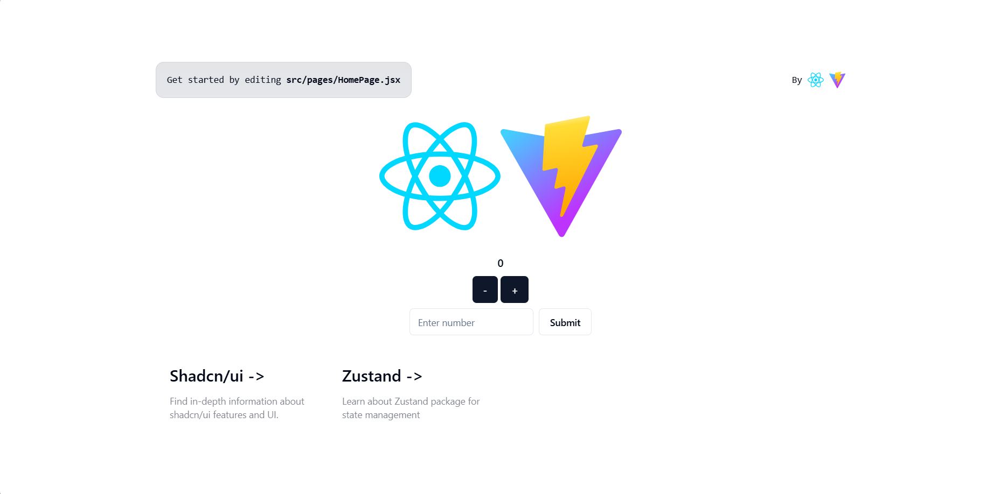

<h1 align="center">
  React+Vite with "shadcn/ui" & "Zustand"
</h1>

<p align="center">
  
</p>

<p align="center">
I created this app using React and Vite, optimized for the fastest development experience for future projects. It can also be used as a default template for anyone.
Here are some packages that have been added – check below.
</p>

# Usage

To clone and use this template type the following commands:

```sh
git clone https://github.com/jayveedev-alt/my-app.git
```

```sh
cd my-app
```

Then, install dependencies:

## npm

```sh
npm install
```

```sh
npm run dev
```

<br />

> [!TIP]
> Remember to update the project name inside the `package.json` file.

<br />

## ⚗️ Technologies list

-   [Zustand](https://docs.pmnd.rs/zustand/getting-started/introduction)
-   [Tailwind CSS](https://tailwindui.com/)
-   [Shadcn/ui](https://ui.shadcn.com/)

---

<br />

Runs the app in the development mode.\
Open [http://localhost:3000](http://localhost:3000) to view it in the browser.

<br />

Launches the test runner in the interactive watch mode.

<br />

## 🦾 build

```
npm build
```

or

```
yarn build
```

Builds the app for production to the `build` folder.\
It correctly bundles React in production mode and optimizes the build for the best performance.

The build is minified and the filenames include the hashes.

<br />

# 📖 Learn More

You can learn more in the [Vite documentation](https://vitejs.dev/guide/).

To learn React, check out the [React documentation](https://reactjs.org/).

#

